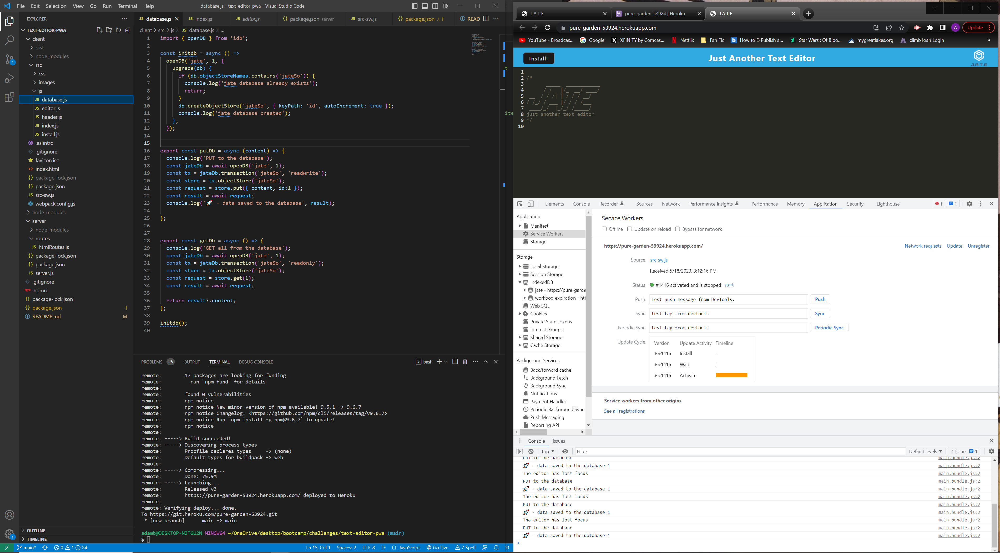

# text-editor-pwa

## Description

-as developer my supervisor waned an alternated text editor with offline functionality. 
- After being provided with the started code i proceeded to fill in the necessary code. I first started with checking the package.json files to make sure the relevant dependancies were there. after adding those I moved on building the server and the necessary routes. next was the database.js for the actual put and get functionality. From there added the relevant plugins in the webpack and finally the src-sw file and developed the cache code.
- I was successful in deploying the application and have persistance both online and offline.
- During this project I leaned the importance of correct process for opening and using databases, and the use of cache strategies.

## Table of Contents 

- [Installation](#installation)
- [Usage](#usage)
- [Credits](#credits)
- [License](#license)

## Installation

- it is necessary to npm install prior to running either nodemon or node to activate the server.
[CrowTrooper202](https://github.com/CrowTrooper202/text-editor-pwa)

## Usage

## Credits

N/A

## License

N/A